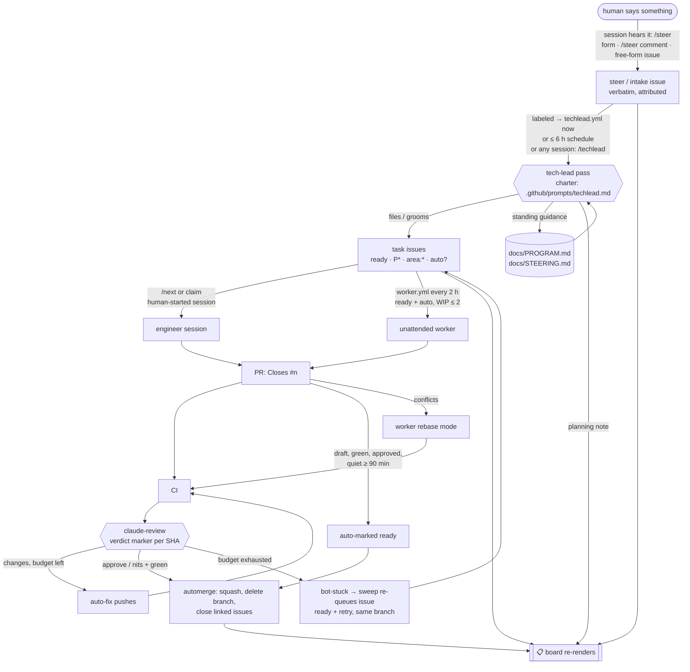

# How work flows in tekton — humans steer, coding sessions are the tech leads, bots carry the pipeline

This is the operating system of the repository: who decides what gets built, where that is
written down, and how a change travels from an idea to `main` with nobody clicking anything.
`CLAUDE.md` §4 is the terse, always-loaded version every coding session obeys; this page is the
full reference with the reasoning. It was mandated by the people who own the project (steer
[#54](https://github.com/ckaragitz/tekton/issues/54)) after an earlier process left humans
writing the tickets: *"you (CC) should be figuring out what needs to be done based on the
overall project goals … You are our tech leads … you are in charge of the task list and reqs and
stories … we can steer you."*

## 1. Principles

1. **Sessions own the backlog.** Requirements, stories, tasks, priorities, retirement — written
   by the coding sessions (interactive or unattended) from the program goals. Humans never have
   to file a ticket, assign, review, merge, or close anything.
2. **Humans steer, and steers are sacred.** Anything a human volunteers — a want, an opinion, a
   priority call, a correction — is obeyed, **logged verbatim the moment it is heard**, and traced
   to the issues it produced. A steer that conflicts with a hard rule (`CLAUDE.md` §1) is not
   silently dropped either: it becomes a `needs-decision` issue that says so.
3. **No state in anyone's head.** People switch laptops off; sessions end mid-sentence and resume
   as strangers. Everything lives in GitHub — issues, labels, PRs, comments, the records in
   `docs/inbox/` — and every automation runs server-side in Actions. A session that vanishes
   loses nothing but its own scrollback.
4. **The pipeline has no silent human dead-ends.** From pushed code to merged PR, every state
   either advances by itself or lands, labelled, in the one place humans look (the board's
   *Waiting on a human* section) with the reason.
5. **Deterministic where possible, judgement where needed, bounded always.** Queue order, board,
   hygiene, merge rules are plain code on the built-in `GITHUB_TOKEN`. Triage, planning,
   implementing, reviewing use a model — with per-run caps, WIP limits, a daily budget, a pause
   switch, and an audit trail (planning notes, verdict markers).

## 2. Roles

| Role | Who | Does | Never has to |
|---|---|---|---|
| **Steerer** | any human on the repo (owner, Chase, …) | says what they want, in plain words, wherever convenient; answers `needs-decision` questions; does the few physical things in §10 | write tickets, groom, assign, review, merge, close, keep a session alive |
| **Tech lead** | every coding session — yours, anyone's, and the scheduled `techlead` planner — following one charter (`.github/prompts/techlead.md`) | logs steers, triages them into requirements, keeps the queue stocked and ordered from `docs/PROGRAM.md`, retires the obsolete, decides what the unattended worker may take, leaves planning notes | wait for permission to plan |
| **Engineer** | every coding session, and the scheduled `worker` (`.github/prompts/worker.md`) | claims one issue, branches, implements per `CLAUDE.md`, opens the PR | shepherd the PR afterwards — the bots do |
| **Pipeline bots** | `coord`, `CI`, `claude-review`, `automerge`, `board` (GitHub Actions) | claim enforcement, intake, review + bounded auto-fix, auto-ready, merge, issue closing, re-queueing, the board | — |
| **Orchestrator (legacy name)** | was a rotating human; now = the tech-lead loop above | the only orchestration left to humans is listed in §10 | — |

## 3. Artifacts — where the truth lives

| Artifact | What it is | Who writes it | Loaded into sessions |
|---|---|---|---|
| `docs/PROGRAM.md` | program goals + current objectives, ordered — what tech leads plan *from* | sessions (via PR); humans steer it | yes — imported by `CLAUDE.md` |
| `docs/STEERING.md` | ledger of standing human steers (rules/preferences) with IDs | tech leads, one row per standing steer | yes — imported by `CLAUDE.md` |
| **Steer issues** (label `steer` / `intake`) | each human input, verbatim, attributed, timestamped; comments = follow-up steers | whoever hears it (session, `/steer`, the form, `coord` intake) | via the brief / board |
| **Task issues** | the backlog: title = checkable DONE; body = Why / DONE / Territory / Evidence / Context; labels = priority + area + state + provenance | tech leads (`from-steer`, `planned`), sessions mid-work (follow-ups) | via `/next`, brief |
| **The board** (issue labelled `board`, pinned) | rendered live view: in progress · in review + exact merge blocker · next up · waiting on a human · steers · done · health | `board.yml` → `tools/dev/techlead.py board`, hourly + on events | `/board`, SessionStart banner |
| Planning notes | one comment per planner pass on the board issue: what was triaged/filed/closed and why | the tech lead that ran the pass | — |
| `docs/inbox/<stream>.md` | per-workstream record with evidence and `BRANCH STATE` | the engineer | on demand |
| `TRACKER.md`, `KNOWLEDGE.md` | curated roadmap summary; institutional memory (hot files) | tech leads via small PRs | `KNOWLEDGE.md` on demand |
| `.github/autonomy.json` | the knobs (§11) | anyone via PR (bot-mergeable) | read at run time by every bot |

## 4. The loop

Timings on the unhappy paths: a missing review verdict is re-requested after 20 min and parked
`bot-stuck` after 4 h; a stuck PR's issue is re-queued after 24 quiet hours; an untouched draft is
nudged at 5 days and closed (branch kept, issue re-queued) at 14; a dead worker lease is freed
after 3 h; an abandoned human claim (no PR, no activity) after 72 h.

## 5. How humans steer (pick whichever is at hand)

| Channel | How | What happens |
|---|---|---|
| Talk to your session | just say it | the session runs `/steer` → a `steer` issue exists before it acts; it obeys immediately and/or files derived work |
| GitHub, one box | *Issues → New → 🧭 Steer the tech leads* (works on the phone app) | issue lands with label `steer` → planner triggered within a minute |
| Any issue or PR thread | comment `/steer <what you want>` | `coord` copies it verbatim into a new `steer` issue, links back, wakes the planner |
| Just file an issue any old way | free-form text, no template | `coord` labels it `intake` (no DONE section = human input, not a task) → same triage |
| A document | drop a markdown file in `docs/requirements/` via PR (legacy drop-box) | `requirements.yml` files a `ready` + `from-requirement` issue on merge |
| Emergency brake | put label `bots-paused` on the board issue | planner + worker idle; reviews/merges continue; remove the label to resume |

What comes back: a comment on the steer restating it and linking every issue it became; the
issues carry `from-steer` and `Refs #<steer>`; standing guidance gets a row in `docs/STEERING.md`
(and thereby into every future session's context); the board shows the steer until triaged.
Disagree with the reading? Reply on the steer — replies are steers.

## 6. Session protocol (human-started sessions) — the short form is `CLAUDE.md` §4

Every session, in this order, before writing code: (1) `git fetch` / start from `main`;
(2) service your own open PRs (red CI, 🛑 review, `bot-stuck`); (3) **log any steer** your human
gave you (`/steer`); (4) if there are untriaged steers, or `ready & unassigned` is below the
floor, run a tech-lead pass (`/techlead`, ≤ 10 min, bounded by the charter); (5) resume your
assigned issue or take the head of the queue (`/next`); claim → branch from `main` → push early →
draft PR with `Closes #n`. When you stop — for an hour or forever — push, and make the PR body or
the record say where things stand. The bots take the PR the rest of the way: review, bounded
fixes, auto-ready after 90 quiet minutes if green and approved, squash-merge, issue closed, board
updated. If it cannot be finished automatically it is re-queued with your notes for the next
session, not left for a human to notice.

## 7. Labels and states

| Label | Meaning | Set by |
|---|---|---|
| `steer` / `intake` | human input awaiting triage (verbatim) / free-form human issue | form, `/steer`, sessions / `coord` |
| `triaged` | steer processed; derived issues linked | tech lead |
| `from-steer` · `planned` · `from-requirement` | provenance of a task issue | tech lead / `requirements.yml` |
| `ready` | doable now from a fresh clone; unassigned = free (`/next` hands out the head) | tech lead |
| `P0` `P1` `P2` · `area:*` · `good-first-pick` · `hot-file` · `epic` | priority · subsystem · onboarding-friendly · serialized file · parent of tasks | tech lead |
| `blocked` · `needs-viewer` · `needs-revit-desktop` · `owner-machine` · `needs-decision` | gated on something/someone physical (§10) — never in the queue | tech lead |
| `auto` | cleared for the unattended worker (criteria in the charter §4) | tech lead |
| `bot-working` | leased by the worker right now (yields to a human `/claim`) | `worker.yml` |
| `retry` | re-queued after a stuck/stale attempt: continue the named branch | board sweep |
| `bot-stuck` (PR) | bots exhausted the fix budget or cannot get a verdict; issue will be re-queued | `claude-review` / `automerge` |
| `needs-rebase` (PR) · `duplicate-pr` (PR) · `stale` (PR) | conflicts, rebase job dispatched · second PR for one issue, older wins · untouched draft | `automerge` / sweep |
| `needs-human` (PR) | genuinely needs a person: workflow-file merge without `AUTOMERGE_TOKEN`, or GitHub refused the merge | `automerge` |
| `wip` · `do-not-merge` · `merge-when-green` (PR) | hold a draft from auto-ready · hold anything · human substitute for the AI verdict (non-author) | humans / sessions |
| `needs-issue` · `overlap` · `stacked` (PR) | no `Closes #n` · issue held by someone else or rival PR · based on another PR's branch | `coord` |
| `board` · `tracking` · `bots-paused` | the board issue · context-only issues · pause switch (on the board issue) | system / humans |

## 8. The bots

| Workflow | Runs on | Token | Does |
|---|---|---|---|
| `coord.yml` | comments, issue open/assign, PR open/edit, hourly | built-in | `/claim` `/release` `/next` `/steer`; one holder per issue; intake labelling + duplicate hints; PR↔issue link/overlap/stacked checks; stacked-PR rescue; orphan-branch draft PRs; 72 h stale-claim reaper |
| `board.yml` | issue/PR events, bot workflows finishing, hourly | built-in | hygiene sweep (re-queue stuck, free dead leases, nudge/close stale drafts) then re-render + pin the board |
| `CI` (`ci.yml`) | every PR push, `main`, dispatch | built-in | portable paths, plugin drift, plugin structure, fast test shard (py3.11 + 3.12) |
| `claude-review.yml` | every PR push; dispatch (re-request); red CI | Claude | review → verdict marker per head SHA (rescue pass if missing); bounded auto-fix on 🛑 and on red CI (budget 3, reset-aware); exhaustion → `bot-stuck` |
| `automerge.yml` | CI/review finishing, labels, every 30 min | built-in (+ optional `AUTOMERGE_TOKEN`) | zero-check CI dispatch; review re-request; quiet-draft auto-ready; conflict → rebase dispatch; squash-merge; close linked issues; duplicate parking |
| `techlead.yml` | every 6 h, on `steer`/`intake` labels, dispatch | Claude | the tech-lead pass (§4 of the charter): triage, groom, replenish, `auto` marking, planning note; ≤ 5 new issues/run; may open one docs PR |
| `worker.yml` | every 2 h, dispatch (also `mode=rebase` from automerge) | Claude | pick (deterministic) → lease → implement per `CLAUDE.md` → PR `Closes #n`; WIP ≤ 2 bot PRs, ≤ 4 runs/day |
| `requirements.yml` | push to `main` under `docs/requirements/` | built-in | legacy drop-box: one issue per requirement file |
| `claude.yml` | `@claude` mentions | Claude | answer / push a change on request |

"Claude" token = the repo secret `CLAUDE_CODE_OAUTH_TOKEN` (or `ANTHROPIC_API_KEY`) — the
owner's personal choice for this personal repo. Without it the model-backed rows are skipped or
red by design and the loop degrades gracefully: humans' own sessions do the planning at session
start and shepherd their PRs (per-PR Auto-fix in cloud sessions), while `coord`, `board`, `CI`
and `automerge`'s label path keep working on the built-in token.

## 9. What the bots will and will not do on their own

They will: file, edit, relabel, and close issues; comment; open PRs; push commits to PR branches
(fixes, conflict merges); mark quiet drafts ready; squash-merge green + approved PRs; delete
merged branches; close linked issues; re-queue stuck work; pin and rewrite the board issue.

They will not: force-push; push to `main`; merge anything red, unreviewed, conflicting, or held;
edit `.github/workflows/**` in unattended runs; strip a gate label to make work look ready; assign
a human; act on a steer that breaks a hard rule; run the full test suite; touch anything under
the git-ignored third-party dirs; certify a file as loading in Revit (only the ledger does).

## 10. What still needs a human, and why

This is the complete list. Everything on it shows up in the board's *Waiting on a human* section
with the reason; nothing else should ever wait on a person — if it does, that is a bug in this
system (file it, `area:process`).

| Needs a person | Why it cannot be automated | How it is surfaced | Optional way to remove it |
|---|---|---|---|
| Merging a PR that changes `.github/workflows/**` | GitHub forbids the Actions token from merging workflow changes (platform rule) | PR labelled `needs-human` + comment; board | add a fine-grained PAT of the owner (contents + pull requests + workflows: write, this repo only) as secret `AUTOMERGE_TOKEN` — automerge then merges these too. Logic lives in `tools/dev/*.py` + prompts + `autonomy.json` precisely so workflow files rarely change. |
| `needs-decision` issues | money, legal/counsel (C1/C4/C5, trademark), going public, product direction calls the steerers reserved | issue label; board; planning note | answer in a comment (it is a steer); the tech leads proceed |
| Viewer certification uploads (`needs-viewer`) | Autodesk's viewer needs an interactive login; rule 4 makes it the arbiter | sessions STAGE batches (`probe_batch.py stage`) and stop at READY; board lists them | none by design (no APS — rule 7) |
| Desktop-Revit checks (`needs-revit-desktop`) | needs a licensed desktop install a bot may not touch (rule 2) | label; board | none by design |
| `owner-machine` work | needs the quarantined `samples/` corpus that must never leave that machine (rule 3/6) | label; board | run a session on that machine; it follows the same protocol |
| Keeping the lights on | the Claude token expires yearly; Actions minutes and model usage are billed to the owner | `claude-review` goes red / planner+worker skipped → board Health line | renew `claude setup-token`; tune cadence in `autonomy.json` |
| One-time repo settings | only an admin can tick them | noted here | *Settings → General → Automatically delete head branches*; *Settings → Actions → General → Allow GitHub Actions to create and approve pull requests* (lets `coord` open orphan draft PRs and the bots mark drafts ready); pin the board issue if the token could not |

## 11. Knobs, budgets, and the pause switch

`.github/autonomy.json` (read from the default branch at run time; defaults in
`tools/dev/techlead.py`):

| Key | Default | Effect |
|---|---|---|
| `planner.ready_floor` / `ready_ceiling` | 4 / 12 | replenish below the floor; never file past the ceiling |
| `planner.max_new_issues_per_run` · `max_turns` | 5 · 60 | per-pass caps |
| `worker.enabled` · `eligible` | true · `auto` | `auto` = only issues the tech lead cleared; `any-ready` = any queue head |
| `worker.wip_limit` · `max_runs_per_day` · `allow_hot_file` · `max_turns` | 2 · 4 · false · 120 | unattended throughput and blast radius |
| `pipeline.quiet_minutes` | 90 | green + approved draft with no commits this long → auto-ready → merge |
| `pipeline.max_fix_attempts` | 3 | auto-fix passes per PR since the last budget reset |
| `pipeline.requeue_stuck_after_hours` · `stale_draft_days` · `close_stale_days` · `worker_lease_hours` | 24 · 5 · 14 · 3 | hygiene timings |
| `pause_label` | `bots-paused` | label on the board issue pauses planner + worker |

Rough running cost at defaults (private repo): Actions minutes ≈ automerge 48×/day + coord
24×/day + board ~40×/day, each well under a minute, plus CI per push; model usage ≈ one review
(+ maybe a fix) per push, ≤ 4 planner passes/day (three of them exit early when nothing needs
judgement), ≤ 4 worker runs/day. Halve the crons or lower the caps in `autonomy.json` if the
owner's plan feels it; set `worker.enabled=false` to keep planning but stop unattended coding.

## 12. Changing this system

- Behaviour of the board, queue, pick, sweep, steer log: `tools/dev/techlead.py` /
  `tools/dev/coord.py` (+ `tests/test_techlead.py`, `tests/test_coord.py` in the CI shard) —
  ordinary PRs, bot-mergeable.
- What the planner/worker *do*: `.github/prompts/*.md` — ordinary PRs. Knobs:
  `.github/autonomy.json`.
- Triggers, permissions, secrets: `.github/workflows/*.yml` — the one kind of PR the owner merges
  by hand (or `AUTOMERGE_TOKEN`). Keep YAML thin for exactly this reason.
- The rules sessions follow: `CLAUDE.md` §4 (hot file: tiny PR, `hot-file` issue) and this page.
- Process changes are work like any other: an issue (`area:process`), a record, a PR. Steers about
  the process are steers.

## 13. Failure modes and how each heals

| Failure | What happens |
|---|---|
| Session dies mid-work, branch pushed, no PR | `coord` sweep opens a draft PR for the orphan branch after 20 min (or lists it on a tracking issue) |
| Session dies with a green, approved draft | `automerge` marks it ready after 90 quiet min and merges |
| Session dies with a red / 🛑 PR | auto-fix passes (≤ 3); then `bot-stuck` → after 24 h the issue is `ready`+`retry`, unassigned, pointing at the branch; `/next` or the worker continues it with a fresh budget |
| Claim abandoned without a PR | 72 h reaper unassigns; issue back in the queue |
| Review run ends without a verdict (turn cap, crash) | rescue pass in the same run; else `automerge` re-requests the review; after 4 h `bot-stuck` |
| Bot merge did not close the linked issue | `automerge` closes linked issues itself after every merge |
| PR conflicts with `main` | `automerge` dispatches the worker's rebase mode; result re-reviewed and merged |
| Two PRs for one issue | newer gets `duplicate-pr`; planner closes the worse one; `coord` warned at open time |
| Worker run dies after leasing | lease freed after 3 h by the board sweep |
| Planner files junk | bounded to 5/run; everything it did is in its planning note; humans steer ("stop filing X"), which outranks its judgement next pass; `bots-paused` stops it cold |
| No Claude token / token expired | model rows go red/skipped, visible in board Health; token-free rows keep the queue, claims, board and label-path merges working; sessions plan and shepherd manually |
| GitHub API hiccup in a sweep | every bot action is idempotent (marker comments, labels); the next run converges |
