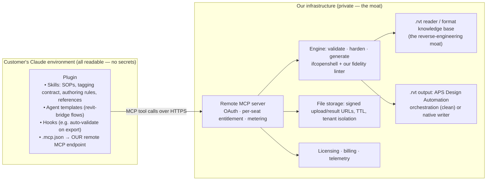

# Productization architecture — licensing rev-revit with protected IP

Status: PLAN (decision draft). Owner: orchestrator + user. Feeds Epic G in
TRACKER.md.

## Goal & constraints

Sell licenses so customers install rev-revit into THEIR OWN Claude
environments (Cowork / claude.ai / Claude Code), ideally as a **plugin**
bundling Skills, hooks and agent templates — while the proprietary engine
(the Python code, the reverse-engineered `.rvt` format knowledge, the
hardening algorithms, any `.rvt` writer) is **unreadable by the customer's
Claude and by human eyes**.

## The governing insight

Files installed into a customer's Claude are readable by definition —
skills, hooks, agent templates, and any bundled scripts are text/artifacts
Claude loads. Therefore **anything shipped is disclosed**. Protection is
achieved not by obfuscating what we ship, but by **not shipping the
engine at all**. The engine runs on OUR servers; customers get an
authenticated capability, never the code.

This makes the three floated options rank cleanly:

| Option | Protection | Runs in Design (browser)? | Verdict |
|---|---|---|---|
| Compiled binary + skill | Weak — PyInstaller trivially unpacked; Nuitka better but still reversible; per-OS builds; offline license checks are crackable; **cannot run in Design at all**; sandboxes may block arbitrary executables | No | Reject as primary. Niche later: air-gapped/enterprise offline SKU (Nuitka + license file). |
| Skill instructs Claude to POST multipart to our API | Strong — engine never leaves our servers | Design can't POST from a project; Cowork's sandbox often blocks arbitrary egress | Right *model*, wrong *transport*: raw HTTP from a sandbox fights egress rules and gives Claude untyped ad-hoc plumbing. |
| **Remote MCP bundled in the plugin** | **Strong — same server-side moat, plus** typed tools, OAuth, per-seat entitlement, metering, revocation, instant updates; MCP is the *sanctioned* network path from Claude surfaces (sidesteps sandbox egress) | Cowork/claude.ai/Code: yes via connector. Design: consumes results, not the runner | **PRIMARY.** |

## Target architecture

- **What ships (disclosed, contains zero secrets):** the knowledge layer.
  SOPs, the `userData.ifc` tagging contract, authoring rules, Revit-import
  facts (largely public knowledge anyway), tool *interface* descriptions,
  the connector config. Like a car's owner's manual — knowing how to drive
  it does not let you build the engine.
- **What stays private:** the Python engine, the schema/paging/ECC/object-
  model knowledge base, hardening algorithms, spec→IFC generator, any
  `.rvt` writer. Licensing = the OAuth account / API-key entitlement:
  per-seat, revocable, meterable (per file / per generation).
- **File transport:** MCP tool payloads have size limits, so large models
  use the signed-URL pattern — tool returns an upload URL, engine
  processes, tool returns a signed download URL; Cowork saves the result
  locally. Small files can travel inline (base64).

## Rollout sequence — DECIDED (user, 2026-08-03)

1. **Phase 1 — the plugin carries everything.** Ship a Claude Code plugin
   whose skills bundle the full engine (scripts, examples, agent
   templates, the `rvt` Python package) so the brothers can automate whole
   jobs from Claude Design / claude.ai / Cowork / Claude Code with no
   backend. The code physically lives in the plugin.
2. **Phase 2 — the plugin exposes the MCP server.** The same plugin ships
   (or points at) the remote MCP server; the on-disk skill instructions and
   scripts shrink to LIGHTWEIGHT descriptions of how to use the MCP tools —
   the engine moves server-side behind entitlement/metering, and the plugin
   becomes the thin, readable knowledge/wiring layer. Design every skill so
   its instructions can later be rewritten to reference MCP tools instead of
   local scripts without changing the user's workflow.

## The client-side JS exporter — DECIDED: fully server-side (option 2)

`ifc-export.js` running inside the customer's Design project would be
inherently visible. USER DECISION: the final product is **fully
server-side, not open-core.** No conversion or hardening logic runs in
the customer's browser or environment.

Chosen design (option 2): Design exports the model in a **standard
interchange it already produces** (the built-in `<three-d-stage>` GLB/OBJ
export, or a plain scene JSON) → the plugin's MCP tool uploads it → **OUR
server performs all Revit-grade conversion** (spec/scene → hardened IFC,
and later `.rvt`). The only client-side residue is generic: "export the
model in a standard format and hand it to the tool" — Design's own
capability, not our IP. Cost: a round trip + upload per export
(acceptable; use signed-URL transport for large models).

Rejected alternative (option 1, open-core): shipping a basic exporter
openly as lead-gen. Instead the funnel, if we want one, is a **free usage
tier** of the same server product (e.g. N conversions/month), not open
code.

Implication for current work: the wave-2 `ifc-export.js` v2 is NOT
wasted — it (a) serves the family beta immediately, and (b) is the
**reference implementation** whose algorithms (placements, extrusion
recovery, type dedupe, instancing, exclusions) get ported into the
server-side engine (Python, or the same JS run server-side under Node).
Keep it algorithmically clean for that port.

## `.rvt` output for the paid product — the clean path

For a *commercial* product, generating native `.rvt` via **Autodesk APS
Design Automation** on our backend is the legally-cleanest, most reliable
route: sanctioned by Autodesk, no reverse-engineered writer shipped or
run, offloads the hardest engineering (the ECC/page-trailer problem). Our
reverse-engineering work then becomes a **reader/validator/inspector
moat** — reading `.rvt` to validate and inspect is far safer legally and
still highly differentiating (nobody else offers deep `.rvt` introspection).
The native writer (Track D) stays a research asset, deployed commercially
only after (a) the ECC gate is solved and (b) legal review.

## Legal note (not legal advice — get counsel before selling `.rvt` write)

Reverse engineering for interoperability is broadly permitted (US DMCA
interoperability exception, EU Software Directive Art. 6), and selling
IFC authoring/hardening/validation tools is unambiguous. Selling a *native
`.rvt` writer* competes with Autodesk's proprietary format and warrants
counsel; precedent exists (the ODA licenses commercial `.rvt` read/write via
BimRv). Autodesk's EULA/APS ToS govern the APS route. Budget a legal review
before the first `.rvt`-write sale; IFC-only tiers need none of this.

## Phased plan

- **Phase 0 (now):** build engine + skill locally. The engine we're writing
  IS the future backend — keep it a clean library behind CLI/skill/MCP front
  doors (already the design) so lifting it server-side is mechanical.
- **Phase 1 — family beta:** brothers use skill-with-scripts in Cowork. No
  IP concern with family; validates the workflow and the SOPs cheaply.
- **Phase 2 — commercial v1:** lift the engine behind a Remote MCP server
  (OAuth, entitlements, metering, signed-URL file transport); ship the
  plugin (skills + hooks + agent templates + connector). IFC hardening +
  spec→IFC generation as the paid capability.
- **Phase 3:** `.rvt` output via APS orchestration; deep `.rvt` inspection
  ("what's in this Revit file") as a differentiating read-side feature.
- **Phase 4 (only if demanded):** offline enterprise SKU — Nuitka-compiled
  engine + node-locked license file, accepting weaker protection.

## Product decisions to make (user)

1. Pricing/entitlement unit: per-seat subscription vs per-file/per-
   generation metering vs hybrid (base seat + generation credits)?
2. Open-core the basic exporter (option 1) or keep all conversion
   server-side (option 2)?
3. `.rvt` in the paid product: APS-orchestrated (clean, per-run Autodesk
   compute cost passed through) vs deferring `.rvt` and selling IFC-only
   tiers first?
4. Is an offline/air-gapped enterprise SKU a real requirement, or can we
   assume connectivity?
5. Multi-tenant SaaS from day one, or single-tenant deployments for early
   design partners?
